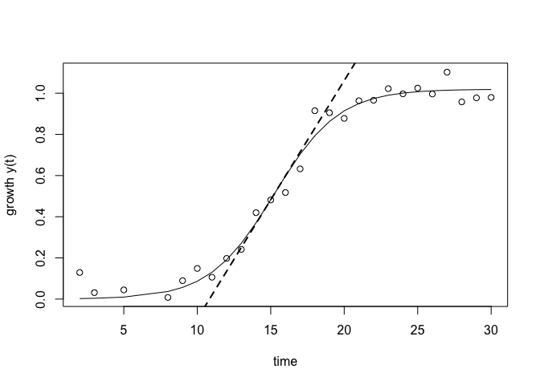
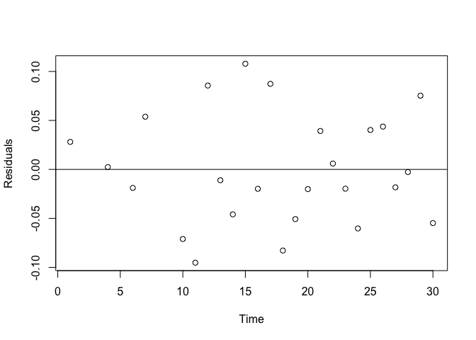

growthcurve
===========

growthcurve is an [R](http://r-project.org) package for analyzing
biological growth curves. It is designed to integrate into modern
workflows, allowing it to be used in conjunction with other tools.

This package is currently a wrapper for the
[grofit](http://cran.r-project.org/web/packages/grofit/index.html)
package, which is no longer being developed. This is temporary, as I
plan to eventually make growthcurve an independent tool with more
flexibility.

Installation
------------

`growthcurve` is not quite ready to be available on
[CRAN](http://cran.r-project.org), but you can use
[devtools](http://cran.r-project.org/web/packages/devtools/index.html)
to install the current development version:

    if(!require("devtools")) install.packages("devtools")
    devtools::install_github("briandconnelly/growthcurve")

**Note that a lot of changes are being made, so things might not always
work.**

Examples
--------

### Fit a single logistic growth curve

Let's take `growthcurve` for a spin by fitting a logistic growth curve
to some data from the included `phage` data set.

    sampledata <- data.frame(Time=1:30, OD600=1/(1+exp(0.5*(15-1:30)))+rnorm(30)/20)
    library(growthcurve)

    # Load the data and take a look at the first few rows:
    data(phage)
    head(phage)

<table>
<colgroup>
<col width="12%" />
<col width="11%" />
<col width="9%" />
<col width="9%" />
<col width="9%" />
</colgroup>
<thead>
<tr class="header">
<th align="center">Strain</th>
<th align="center">Phage</th>
<th align="center">Well</th>
<th align="center">Time</th>
<th align="center">OD420</th>
</tr>
</thead>
<tbody>
<tr class="odd">
<td align="center">WT</td>
<td align="center">TRUE</td>
<td align="center">A1</td>
<td align="center">0</td>
<td align="center">0.3881</td>
</tr>
<tr class="even">
<td align="center">WT</td>
<td align="center">TRUE</td>
<td align="center">A1</td>
<td align="center">180</td>
<td align="center">0.3637</td>
</tr>
<tr class="odd">
<td align="center">WT</td>
<td align="center">TRUE</td>
<td align="center">A1</td>
<td align="center">360</td>
<td align="center">0.346</td>
</tr>
<tr class="even">
<td align="center">WT</td>
<td align="center">TRUE</td>
<td align="center">A1</td>
<td align="center">540</td>
<td align="center">0.3441</td>
</tr>
<tr class="odd">
<td align="center">WT</td>
<td align="center">TRUE</td>
<td align="center">A1</td>
<td align="center">720</td>
<td align="center">0.3337</td>
</tr>
<tr class="even">
<td align="center">WT</td>
<td align="center">TRUE</td>
<td align="center">A1</td>
<td align="center">900</td>
<td align="center">0.3318</td>
</tr>
</tbody>
</table>

In this experiment, [Luis Zaman](http://luis.labfab.cc) measured the
growth of two strains of *E. coli* both with and without phage.
Replicate populations were grown in the wells of a microtiter plate, and
absorbance was measured every three minutes.

Although we eventually want to compare the growth of each population,
we're going to focus on the population in well **A12** for now. We can
get this subset of the data using the `filter` function from
[dplyr](http://cran.r-project.org/web/packages/dplyr/index.html).

    library(dplyr)

    a12data <- filter(phage, Well=="A12")

Now, let's fit a logistic growth curve for this population:

    a12fit <- fit_growth_logistic(a12data, Time, OD420)

Note that we could have gotten fancy and combined the last two steps
using
[magrittr's](http://cran.r-project.org/web/packages/magrittr/index.html)
lovely pipe operator:

    a12fit <- phage %>%
        filter(Well=="A12") %>%
        fit_growth_logistic(Time, OD420)

We can now look at the results to learn about the fit:

    a12fit$max_growth

    ##    Estimate  Std. Error 
    ## 0.980573926 0.002268635

    a12fit$max_rate

    ##     Estimate   Std. Error 
    ## 2.792067e-05 4.572704e-07

    a12fit$lag_length

    ##   Estimate Std. Error 
    ## -8326.2947   349.5622

    a12fit$integral

    ## [1] 73088.97

For this fit, the maximum growth value is 0.980573926 AU
(`a12fit$max_growth`), the maximum growth rate (the slope) is
2.792067e-05 AU/s (`a12fit$max_rate`), the lag phase ends approximately
time -8326.2947 (`a12fit$lag_length`) (obviously not quite right), and
the area under the growth curve is about 73088.97 (`a12fit$integral`).

We can also plot the results:

    plot(a12fit)

If we'd like to take a look at how well the fitted curve matches the
data, we can plot its residuals:

    plot(x=a12fit$grofit$raw.time, y=resid(a12fit), xlab="Time", ylab="Residuals")
    abline(h=0)

So maybe this fit isn't quite right for these data. We can instead use
another method.

To be continued...

Related Links
-------------

-   [grofit](http://cran.r-project.org/web/packages/grofit/index.html)

License
-------

growthcurve is released under the Simplified BSD License.
