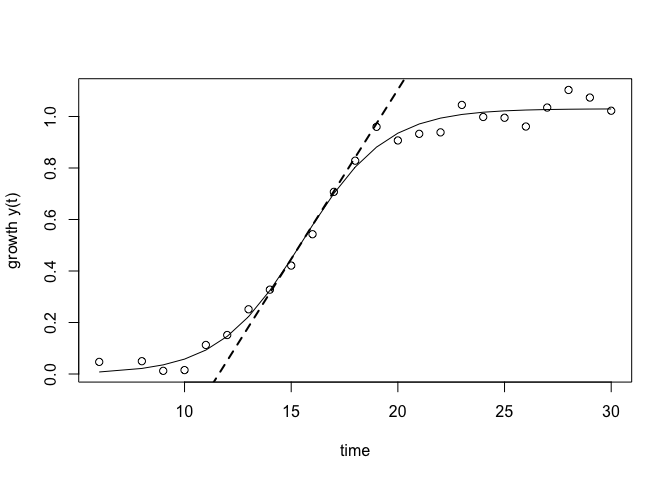

growthcurve
===========

growthcurve is an [R](http://r-project.org) package for analyzing
biological growth curves. It is designed to integrate into modern
workflows, allowing it to be used in conjunction with powerful tools
like [dplyr](http://cran.r-project.org/web/packages/dplyr/index.html)
and
[magrittr](http://cran.r-project.org/web/packages/magrittr/index.html).

This package is currently a wrapper for the powerful
[grofit](http://cran.r-project.org/web/packages/grofit/index.html)
package, which is no longer being developed. This is temporary, as I
plan to eventually make growthcurve an independent tool with more
flexibility.

Installation
------------

`growthcurve` is not quite ready to be available on
[CRAN](http://cran.r-project.org), but you can use
[devtools](http://cran.r-project.org/web/packages/devtools/index.html)
to install the current development version:

    if(!require('devtools')) install.packages('devtools')
    devtools::install_github('briandconnelly/growthcurve')

Note that a lot of changes are being made right now, so things may not always work.

Examples
--------

### Fit a logistic growth curve

First, let's create some sample data containing some time points in the
*Time* column and some corresponding growth measurements in the *OD600*
column and take a look at the first few rows:

    sampledata <- data.frame(Time=1:30, OD600=1/(1+exp(0.5*(15-1:30)))+rnorm(30)/20)

<table>
<colgroup>
<col width="9%" />
<col width="12%" />
</colgroup>
<thead>
<tr class="header">
<th align="center">Time</th>
<th align="center">OD600</th>
</tr>
</thead>
<tbody>
<tr class="odd">
<td align="center">1</td>
<td align="center">-0.07</td>
</tr>
<tr class="even">
<td align="center">2</td>
<td align="center">0.1291</td>
</tr>
<tr class="odd">
<td align="center">3</td>
<td align="center">0.0313</td>
</tr>
<tr class="even">
<td align="center">4</td>
<td align="center">-0.07022</td>
</tr>
<tr class="odd">
<td align="center">5</td>
<td align="center">0.04461</td>
</tr>
<tr class="even">
<td align="center">6</td>
<td align="center">-0.009969</td>
</tr>
</tbody>
</table>

(let's pretend like negative values for OD600 are ok for now)

Now, let's fit a logistic growth curve for this data set:

    library(growthcurve)

    lfit <- fit_growth_logistic(sampledata, Time, OD600)

Information about the logistic fit is available in `parameters`:

    lfit$parameters

    ## $A
    ##   Estimate Std. Error 
    ## 1.01919333 0.02091845 
    ## 
    ## $mu
    ##    Estimate  Std. Error 
    ## 0.115715828 0.009940762 
    ## 
    ## $lambda
    ##   Estimate Std. Error 
    ## 10.8306195  0.4194161 
    ## 
    ## $integral
    ## [1] 15.04583

For this fit, the maximum growth value is 0.99848023
(`lfit$parameters$A`), the maximum growth rate (the slope) is
0.127109284 (`lfit$parameters$mu`), the lag phase ends approximately
time 10.9985254 (`lfit$parameters$lambda`), and the area under the
growth curve is about 15 (`lfit$parameters$integral`). The units for
these results depend on the units in the input data.

We can also plot the results:

    plot(lfit)

If we'd like to take a look at how well the fitted curve matches the
data, we can plot its residuals:

    lfit.res <- residuals(lfit)
    plot(x=lfit$raw.time, y=lfit.res, xlab='Time', ylab='Residuals')
    abline(h=0)

### Integrating other tools

As we saw earlier, our sample data contains some negative values. If we
want to strip those out before fitting, we can first use `filter` from
the excellent
[dplyr](http://cran.r-project.org/web/packages/dplyr/index.html) package
and then pipe the results to our fitting function using the pipe
operator (`%>%`) from
[magrittr](http://cran.r-project.org/web/packages/magrittr/index.html).
While we're at it, maybe it takes a while for our machine to warm up, so
let's also only use the data after time point 5.

    library(dplyr)
    library(magrittr)
    library(growthcurve)

    sampledata <- data.frame(Time=1:30, OD600=1/(1+exp(0.5*(15-1:30)))+rnorm(30)/20)
    lfit2 <- sampledata %>%
        filter(OD600 >= 0) %>%
        filter(Time > 5) %>%
        fit_growth_logistic(Time, OD600)
        
    plot(lfit2)

Feature Requests and Bug Reports
--------------------------------

For all feature requests and bug reports, visit [growthcurve on
GitHub](https://github.com/briandconnelly/growthcurve/issues).

Related Links
-------------

-   [grofit](http://cran.r-project.org/web/packages/grofit/index.html)

License
-------

growthcurve is released under the Simplified BSD License.
