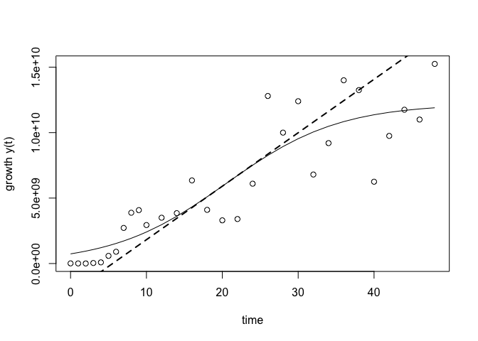

growthcurve
===========

growthcurve is an [R](http://r-project.org) package for analyzing
biological growth curves. It is designed to integrate into modern
workflows, allowing it to be used in conjunction with other tools.

This package is currently a wrapper for the
[grofit](http://cran.r-project.org/web/packages/grofit/index.html)
package, which is no longer being developed. This is temporary, as I
plan to eventually make growthcurve an independent tool with more
flexibility.

Installation
------------

`growthcurve` is not quite ready to be available on
[CRAN](http://cran.r-project.org), but you can use
[devtools](http://cran.r-project.org/web/packages/devtools/index.html)
to install the current development version:

    if(!require("devtools")) install.packages("devtools")
    devtools::install_github("briandconnelly/growthcurve", build_vignettes=TRUE)

**Note that a lot of changes are being made, so things might not always
work.**

Quick Example
-------------

    library(growthcurve)
    library(dplyr)
    library(magrittr)

    # Load the included 'pseudomonas' dataset
    data(pseudomonas)

    # Fit a logistic growth curve for PAO1 replicate 1
    fit <- pseudomonas %>%
        filter(Strain == 'PAO1') %>%
        filter(Replicate == 1) %>%
        fit_growth_logistic(Time, CFUmL)

    plot(fit, show_raw=TRUE)

Vignettes
---------

The included vignettes contain more complete examples of how
`growthcurve` can be used:

-   [vignettes/logistic-growth.Rmd](Fitting%20a%20logistic%20growth%20curve)
-   Comparing growth

Related Links
-------------

-   [grofit](http://cran.r-project.org/web/packages/grofit/index.html)

License
-------

growthcurve is released under the Simplified BSD License.
